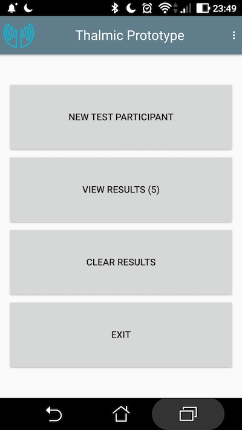
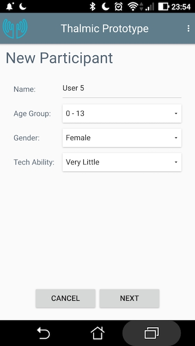

## Tilt Navigation Prototype

This software tests tilt based menu navigation models. There are two models, a two way system where the user can tilt the device up and down to select options, and a four way system where the user can tilt up and down as well as side ways to select the four menu options.

## Tester instructions

This prototype has been tested on an android 7.0 phone. For best results, the phone should be strapped on the wrist of each test subject.

From the main menu, press "New Participant" and have the user enter in their details.

 
