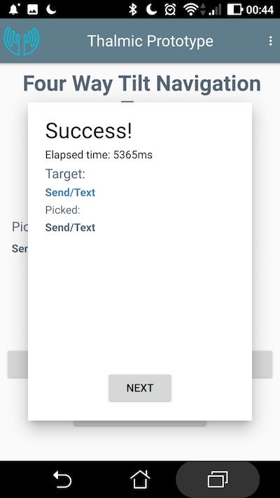

## Tilt Navigation Prototype

This software tests tilt based menu navigation models. There are two models, a two way system where the user can tilt the device up and down to select options, and a four way system where the user can tilt up and down as well as side ways to select the four menu options.

## Tester Usage Instructions

This prototype has been tested on an android 7.0 phone. For best results, the phone should be strapped on the wrist of each test subject.

### Main Menu and New Participant screen.
From the main menu, press "New Participant" and have the user enter in their details.

 

### Ready Screen
Pressing "Next" takes the user to the Ready screen. Have the device securely strapped to the wrist like they're looking at a watch and as flat as possible. Pressing "Start" will proceed to the first test variant (either Two Way or Four Way every other user). This is the reference orientation for the Tilt sensors so it is important for the user to return to this orientation after each selection.

### Two Way Navigation
Here's an example of a Two Way navigation test in progress. The target menu item is presented in blue here as "Pulse". The previous chosen menu items are shown below as "Info/Calendar/Change".

### Result of a test
After every test, the user will be presented with a "Success!" or "Miss!" dialog. Pressing "Next" will proceed to the next test.

### Finishing a Test Variant
After 3 trials of 8 tests are finished for a test variant, the user will choose the ease of use of the navigation of the variant on a scale of 1 - 7, 1 being "Extremely Difficult" and 7 is "Effortless". Pressing "Next" will proceed to the next test variant or back to the Main Menu and concludes the test.

### View Results
Results for all users can be viewed from the Main Menu's "View Result" option. Scrolling down the summary page will show various charts comparing mistakes and success times for test variants and users. There is also a Raw user data page in JSON format.
    

## Troubleshooting
If the menus seem to choose themselves without the user moving the phone, the user can use the global menu (3 dots upper right) to Quit to Main and start again.  This is due to a miss calibration during the Test Ready screen before the user presses start. The device's tilt measurements will be "Zeroed Out" when the user presses start at this screen so it's important the user returns the device to the approximate orientation after each selection.

## Build Instructions

### Dependencies
- [Qt 5.10 with Qt Creator](https://download.qt.io/official_releases/qt/5.10/5.10.0)
- [The Android SDK Tools](https://www.google.com)
- [The Android NDK](https://developer.android.com/ndk/index.html)
- [Java SE Development Kit](http://www.oracle.com/technetwork/java/javase/downloads/index.html)

### Build
1. [Install Qt 5.10 including Android SDKs, NDK, Java JDK with these instructions] (http://doc.qt.io/qt-5/androidgs.html)
2. git clone https://github.com/waynetran/thalmic_proto.git
3. Open thalmic_proto/proto.pro with QtCreator 4.50.
4. Connect your android device (with USB debugging enabled), Make sure a working Qt kit for Android is configured in QtCreator's Preferences/Build & Run/Kits.
5. If a Qt kit is not configured properly, go to QtCreator's Preferences/Devices/Android and make sure the paths to Java, Android SDK and NDK are set.
6. Build, Run and choose your android device.

### Enable USB Debugging on your android device
There are different methods depending on your android version.
See here https://www.kingoapp.com/root-tutorials/how-to-enable-usb-debugging-mode-on-android.htm
